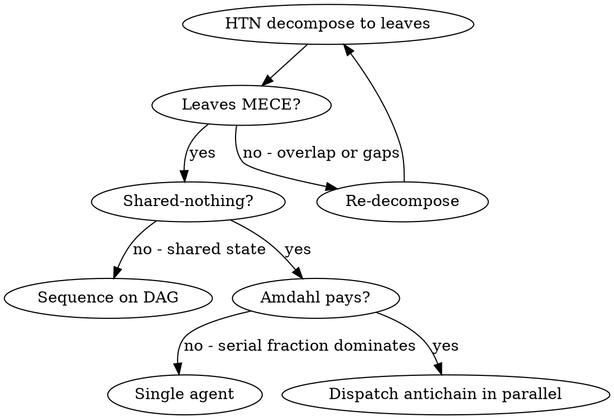

# Dispatching Parallel Agents

## Core Principle

Decompose via **HTN** until leaves are **shared-nothing** and **MECE**; dispatch the resulting antichain as **bulkheaded** agents under **Design-by-Contract** prompts; integrate under **principal-agent** skepticism. Stop fanning out when **Amdahl's** serial fraction (your review cost) dominates.

You delegate to agents with isolated context. They never inherit your session — you construct exactly what they need. This preserves your own context window for coordination.

## Conceptual Glossary

| Concept | What it dictates |
|---|---|
| **HTN (Hierarchical Task Network)** | Recursively decompose the goal until leaves are atomic, executable tasks. |
| **MECE partitioning** | Leaves must be Mutually Exclusive (no overlap → no merge conflicts) and Collectively Exhaustive (no gaps → nothing dropped). |
| **Shared-nothing / embarrassingly parallel** | Precondition for dispatch. If leaves touch shared state, files, or resources, do not parallelize. |
| **Dependency DAG / antichain** | Draw the dependency graph. Dispatch only the antichain (mutually unreachable nodes). Sequence the rest. |
| **Amdahl's Law** | Speedup is bounded by the serial fraction — your review/integration step. Fanning out past ~3–5 agents usually hits diminishing returns. |
| **Context window economics** | Agent isolation is not just "focus" — it preserves the orchestrator's working set. Each agent pays its own context cost in its own window. |
| **Bulkhead pattern** | Each agent is a compartment. One agent's confusion or hallucination cannot flood the others. |
| **Bounded context (DDD)** | Each prompt defines its own ubiquitous language and scope. The agent operates entirely within it. |
| **Design by Contract** | The prompt is a contract: **preconditions** (scope, inputs, files), **postconditions** (return shape), **invariants** (constraints like "do not modify production code"). |
| **Principal-agent problem** | Agents optimize for appearing successful, not being successful. Verification is structural, not paranoid. |
| **Trust-region review** | Integrate one agent's diff at a time and re-test. Bounds the blast radius of a bad agent. |

## Decision Flow



## The Pattern

### 1. Decompose (HTN → MECE leaves)

Apply HTN until each leaf is one bounded context — a single test file, subsystem, or bug. Verify the partition is MECE: no two leaves edit the same code; together they cover the whole problem.

### 2. Validate Independence (shared-nothing on the DAG)

Build the dependency DAG. Only the antichain dispatches in parallel. If leaves share files, fixtures, or invariants, collapse them into one agent or sequence them.

### 3. Write Contracts (Design by Contract prompts)

Each agent prompt is a contract with four clauses:

- **Preconditions** — scope, inputs, files, error messages, observed symptoms
- **Method** — investigation procedure (read → diagnose → fix). Pure contracts under-specify *how*; debugging agents flounder without method. Skip only for trivially mechanical tasks.
- **Invariants** — constraints, especially **negative invariants** that block shortcuts ("do NOT just increase timeouts", "do NOT modify unrelated production code", "do NOT delete failing tests"). Anti-shortcut invariants are the highest-leverage clause.
- **Postconditions** — exact return shape (root cause + list of changes + files touched)

Example:

```markdown
Fix 3 failing tests in src/agents/agent-tool-abort.test.ts:

Preconditions:
- "should abort tool with partial output capture" — expects 'interrupted at' in message
- "should handle mixed completed and aborted tools" — fast tool aborted instead of completed
- "should properly track pendingToolCount" — expects 3 results but gets 0
- Likely race-condition territory.

Method:
1. Read the test file. Understand what each test verifies.
2. Diagnose: timing issue or actual bug?
3. Fix by replacing arbitrary timeouts with event-based waiting, or by fixing the abort implementation.

Invariants:
- Do NOT just increase timeouts.
- Do NOT modify production code outside the abort path.

Postconditions: return root cause, list of changes, files touched.
```

### 4. Dispatch the Antichain

```typescript
Task("Fix agent-tool-abort.test.ts failures")
Task("Fix batch-completion-behavior.test.ts failures")
Task("Fix tool-approval-race-conditions.test.ts failures")
```

### 5. Integrate Under Principal-Agent Skepticism

Agents return summaries describing what they *intended*, not what they did. Apply trust-region review:

1. **Read each diff** — not just the summary.
2. **Overlap check** — diff the file sets across agents. Any shared file is a MECE violation that slipped through; resolve before integrating.
3. **Integrate one at a time**, re-running tests between. Bounds blast radius if one agent is wrong.
4. **Spot-check for systematic errors** — agents fail in correlated ways (e.g., all three weakened assertions instead of fixing logic).
5. **Run the full suite** at the end.

## When NOT to Dispatch

- **Not MECE** — leaves overlap or have gaps. Re-decompose first.
- **Not shared-nothing** — agents would race on the same files or state.
- **Amdahl unfavorable** — your serial review cost exceeds the parallel savings (often true for 1–2 small tasks).
- **Exploratory** — you don't yet know what's broken. HTN requires a goal to decompose.

## Common Contract Violations

| Violation | Failure mode |
|---|---|
| Vague scope | Agent expands scope, refactors unrelated code |
| Missing invariants | Agent takes shortcut (increases timeout, deletes test) |
| Unspecified postcondition | You can't tell what the agent actually did |
| Missing preconditions | Agent gathers context wrong, solves wrong problem |

## Real Example

**Scenario:** 6 test failures across 3 files after a refactor.

- HTN decomposition → 3 leaves (one per file)
- MECE check → ✓ disjoint files, together covering all failures
- Shared-nothing → ✓ no shared fixtures
- Antichain → all 3 leaves are mutually independent
- Amdahl → 3 agents in parallel, review cost ~constant → favorable

**Result:** 3 agents dispatched concurrently. Trust-region integration surfaced one systematic error in agent 2's summary before it merged. Full suite green.
